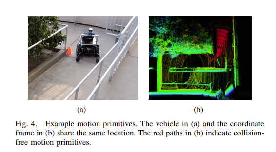
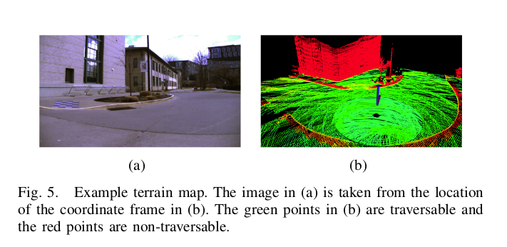
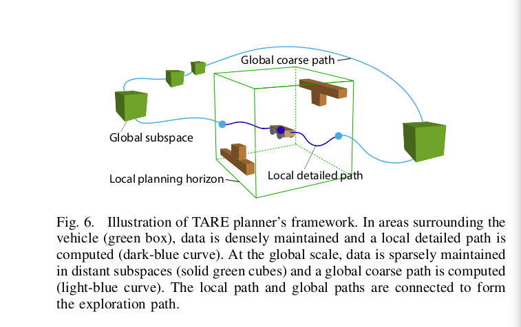
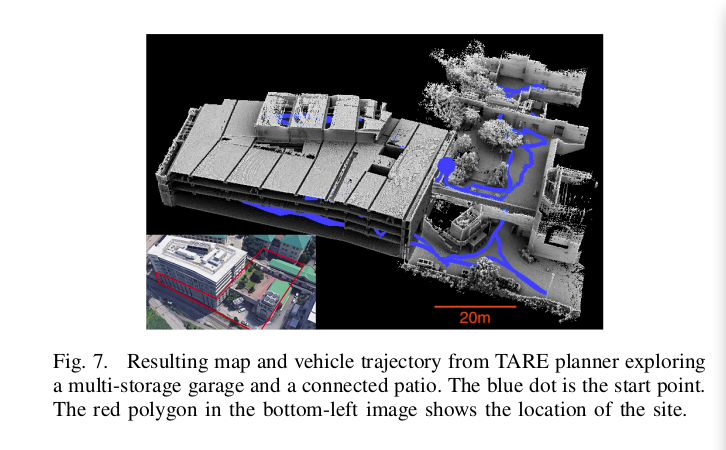
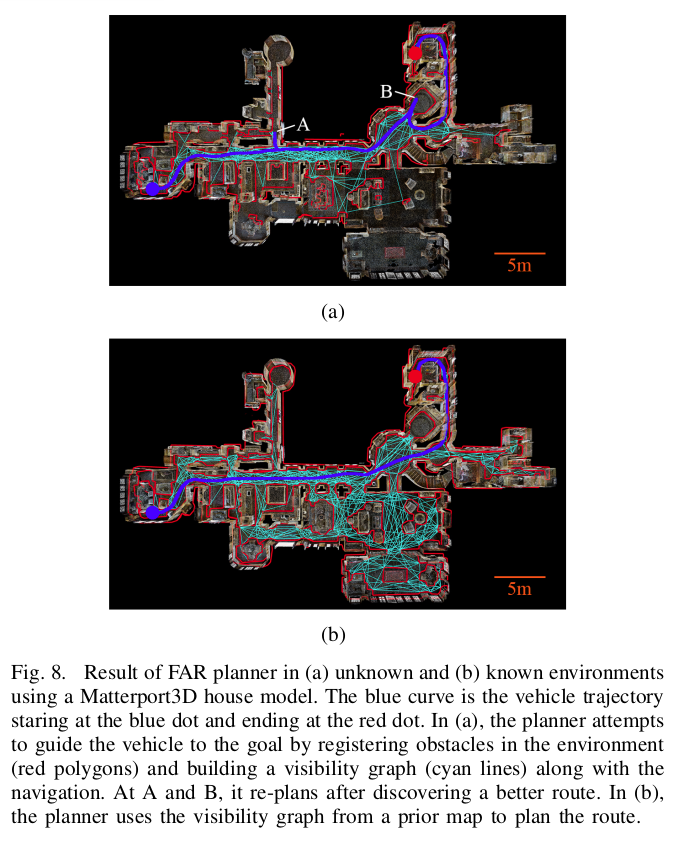
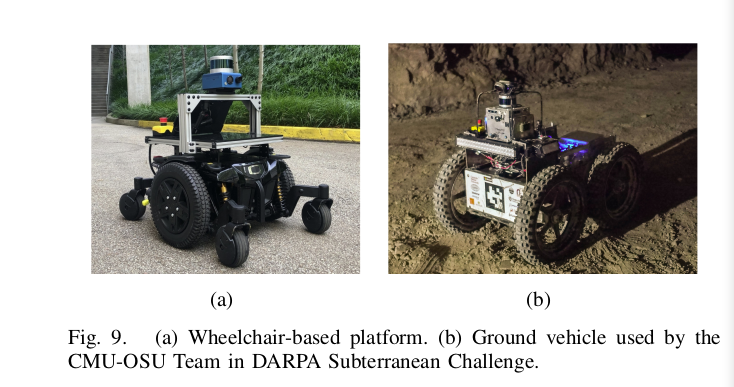
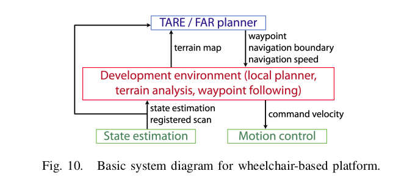
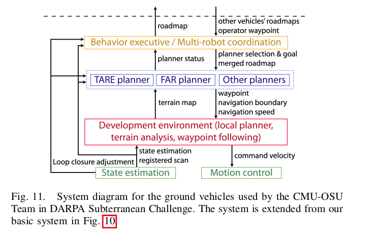
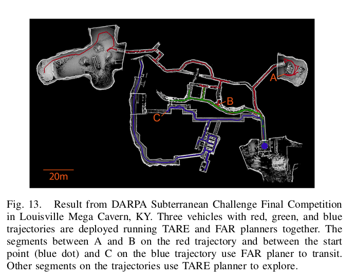

# Autonomous Exploration Development Environment and the Planning Algorithms

## [论文地址](https://arxiv.org/pdf/2110.14573.pdf)

论文地址可能需要科学上wang。如果有原文需要，请私聊我

## 摘要

自主探索开发环境是一个开源存储库，旨在促进高级规划算法的开发和完整的自主导航系统的集成。存储库包含，代表性仿真环境模型，基础导航模块，例如**本地规划器(local_planner)**、**地形可穿越性分析(terrain_analysis)**、**航路点跟踪(Path_Follower)**和**可视化工具(visualization_tools)**。在一起与我们的两个高级规划师发布-**TARE planner**对于勘探和路线规划的**FAR planner**，我们三个开源存储库的详细用法和共享自主导航系统集成方面的经验。

##  1.简介

​		我们的自主勘探开发环境，探索规划算法被命名为**TARE planner**，路径规划算法被叫做**FAR planner**，形成了一整套基于几何的导航规划算法。结合这三个存储库，我们提供了一组通用的基于三维激光雷达的地面车辆导航算法。该软件栈作为开发和部署先进导航系统的平台，有利于研究机构，并进一步支持基于视觉的导航领域的最先进研究**(Translator：Autonomous Exploration Development Environment作为开源仿真平台，可以通过发布/订阅话题来在仿真器中测试自己的算法)**。

​		开发环境旨在促进高级规划算法的开发，我们为使用者提供了一系列环境模型去方便的测试算法。开发环境与Matterport3D的真实感房屋模型进一步兼容。我们提供了一系列基本的导航模块，例如**local planner**来避免碰撞，**地形可穿越性分析(terrain_analysis)**、**航路点跟踪(Path_Follower)**和**可视化工具(visualization_tools)**。在标准的三层自主导航系统中，开发环境充当中间层连接底层的状态估计和运动控制

高效的规划作为顶层。**(Translator：导航/路径规划/避障等模块，作用于环境，来进行状态估计和运动控制)**。我们提供了一系列的兼容的开源状态估计算法用于提供该系统的状态估计

​		我们的导航算法是在考虑到有利于真实系统部署的情况下创建的。我们不能依赖于只能被提供在仿真系统中的不可靠的信息，例如：语义和地形分割基本事实。特别是，我们的地形可穿越性是由一个专用模块计算的，该模块像在真实系统中一样处理范围数据。基本概念是允许用户开发高级规划算法，并方便地将存储库迁移到车辆计算机进行部署

## 2.相关工作

​		自主导航系统已经从多个角度进行了研究。本文中描述的工作基于本节简要讨论的数据集、模拟环境和导航系统中的关键结果

​		**数据集：**

​		**仿真环境：**

​		**导航系统：**

​		**我们的导航系统**

​		**具体内容论文内查看**		

## 3.开发环境

### A.环境模型

​		开发环境作为开发和基准测试地面车辆导航高级规划算法的平台。在这个开发环境中，我们提供了五个环境模型和可视化调试工具

​		环境模型类似于通常部署机器人系统的真实世界设置。每个环境模型都是独特的具有特点和挑战的

​		**具体内容论文内查看**

### B. Local Planner

​		本地路径规划器(local planner)能够保证到达被上层规划器所发出的航路点的过程的安全。它能够计算并跟随无碰撞点路径引导车辆到达目标点。该模块预先计算运动基元库，并将运动基元与车辆附近的3D位置相关联。**(Translator：运动基元是指车辆在有限时间内,在自身约束条件下能够行驶的距离)**。运动基元被建模为蒙特卡洛样本，并分组组织。实时的，当一个地方被障碍物遮挡，模块可以确定在毫秒内与障碍物碰撞的运动基元。然后，模块选择朝向航路点具有最大可能性的运动基元组。在图4中，这个红色的路径代表了无碰撞物运动基元。对于地面车辆，车辆的可通行性由地形特征决定。本地路径规划器(local planner)从地形分析模块(terrain analysis)接收这个地势地图**(Translator：模块LocalPlanner与TerrainAnalysis通过话题通信建立通信，LocalPlanner订阅来自TerrainAnalysis的话题)**。该模块还有一个接口，用于接收额外的距离数据，以避免碰撞，作为扩展选项。**(Translator：该模块订阅了一个话题为`"/navigation_boundary"`的消息用于设置当前主要区域的边界)**

### C. Terrain Traversability Analysis (TerrainAnalysis)

​		地形分析模块检查车辆周围局部地形的可穿越性。该模块构建一个代价地图，其中图上的每个点都与通过代价相关联。代价由周围地形的平整度决定。我们使用体素网格来表示环境，并分析相邻体素中数据点的分布来估计地面高度。如果这些点离地面更远，则它们与更高的通过成本相关联。图5给出了一个以车辆为中心覆盖了40m x 40m地区的地形图的例子。图中这些绿色的特征点为可通过区域，红色的特征点为不可通过区域。此外，地形分析模块可以处理负面障碍，这些障碍通常会导致地形图上没有数据点的空旷区域**(Translator：负面障碍应该为与地面在同一平面内但是没有点云信息，会将他们判定为类似于坑的障碍)**，当启用负障碍物处理时，模块将这些区域视为不可通行。

### D.可视化调试工具

​		为了帮助算法的开发，我们提供了 一系列的可视化工具用来对算法进行演示**(Translator：仿真)**。可视化工具能够放映整个地图，探索的地区和车辆轨迹。绘制探测体积、行进距离和算法运行时间等指标并将其记录到文件中**(Translator：日志)**。此外，该系统支持使用操纵杆控制器干扰导航，在多种操作模式之间切换，以简化系统调试过程。

## 4.上层规划器

​		我们讨论了两个上层规划器**TARE planner**用于探索，**FAR planner**用于路线规划。上层规划器接收状态估计输出并生成特定任务的路点，这些路点由本地规划器在闭环导航中执行。一般来说，上层规划器能够低频的重复规划路线，并且提供远距离的路线，底层导航模块能够迅速做出反应跟随路线并避开障碍物

### A.TARE Planner for Exploration

​		**TARE planner**是一个分层框架，利用环境的两层表示以多分辨率的方式规划勘探路径。如图所示，在图6，规划器使用低分辨率信息来规划全局级别的粗略路径。在车辆周围的局部地区，规划器会使用高分辨率信息规划一些详细的路径。该方法通过解决每个级别的旅行推销员问题来优化整体路径。**(Translator：旅行推销员问题是指：一个推销员需要在若干个城市间旅行，每个城市只能访问一次，并且需要找到一条经过所有城市的最短回路。这是一个NP完全问题，并且没有通用的解决方法。)**，相比现存的依赖于贪心算法的解决方案，本规划器能够更高效的应对结构环境并且产生一个近似最优的探索路径，从而避免重复的访问一个地区**(Translator：为了考虑探索效率，探索时不应该重复访问同一个地区)**。

​		**TARE planner**在模拟和现实世界中的几个大型复杂环境中进行了评估。将其与最先进的方法进行比较，即NBVP、GBP和MBP。结果表明，TARE规划器在勘探和计算方面产生了显著更高的效率。当车辆位于图4(a)所展示环境用来探索一个四车位的车库和一个相连的露台时，图7展示了一个有代表性的结果。这辆车从顶层车库的入口处出发，探索整个环境，用时1907秒行驶了1839米后完成探索，图7展示了这个结果地图和车辆路线。由于空间限制，我们省略了一些环境细节。有关探索的详细评估，请参阅我们的论文和网站。

### B.FAR Planner for Route Planning

​		**FAR planner**是一个基于可见性图的计划器，它动态地构建和维护一个降低可见性的图以及导航。这个规划器能够处理已知和位置两个环境。在已知环境中，他使用已经有的地图去规划路线。然而，在未知的环境中，它会尝试多种方式引导车辆到达目标，并在导航过程中获取环境布局。FAR planner将环境中的障碍物建模为多边形。它提取障碍物周围的边缘点，并将边缘点转换为一组多边形。然后将多边形合并到传感器数据帧上，并由此生成可视化图。

​		FAR planner是在大型复杂环境中进行评估的。将其与RRT* 、RRT-connect、 A* 、D* LIte等路径规划算法进行比较，并展示了其在长距离快速重新规划方面的优势。规划器使用i7计算机上单个CPU线程的~15%来扩展可见性图，并使用第二个CPU线程来进行路径搜索。我们的实验结果表明，一条路径被创建的时间少于0.3ms。图8展显示了使用Matterport3D房屋模型作为环境的代表性结果。在图8(a)中，规划器不使用环境的任何先验信息，并且将环境视为未知。规划器企图通过在环境中动态登记障碍物(红色多边形)指导车辆的前往目标点，并且在导航图中生成可视化图(青色线条)。在图8(b)中，规划者得到了事先的地图。它基于先前地图开发的可见性图进行导航，并在已知环境中规划路线。

## 5.最佳实践

### *安全边际*

​		本地规划器在车辆和路点之间的距离处使用规划范围。这确保了车辆可以停在相对靠近障碍物的路点 - 碰撞检查不考虑比路点更远的障碍物。但是，如果预计车辆不会停在路点，高层规划者最好将路点与车辆保持一定距离（≥3.75m 作为默认规划范围）。如果航路点更近，用户可以将航路点投影得更远并且保持与航路点相同的方向，以充分利用安全余量。在另一方面，如果车辆需要导航穿过狭窄的开口，减少目标距离能够帮助本地规划器发现无碰撞运动基元穿过这个开口

### *急转弯*

​		通常，高级规划器选择沿路径的路点，即车辆前方的距离，即前视距离，并将路点发送给本地规划器（可能在将路点投射到距离车辆更远的位置之后，如上所述 )。当处理急转弯时(>= 90°)，这个车辆前方的距离需要被妥善设置或者这个航路点可能跳到车辆的后面，导致车辆来回贴近。我们建议选择位于车辆视线范围内的路径起始段上的路点。

### *动态障碍物*

​		地形分析模块在动态障碍物移开后，通过光线追踪从地形图中剔除动态障碍物。这是在车辆附近（距车辆≤5m）实施的，因为范围数据在更远的地方变得稀疏，并且很难在消除动态障碍和薄结构之间进行权衡。根据我们的实验，建议用户执行特定于任务的动态障碍物处理。TARE planner和 FAR planner都包含这样一个步骤。

## 6.系统集成

### A.底层系统

​		我们的底层系统使用一个轮式机器人平台如图9。图中车辆配备了一个Velodyne Puck Lidar，一个分辨率为640 x 360的相机和一个MEMS-based IMU。4.1GHz i7计算机处理板载处理。图10展示了底层系统的框架图。开发环境起到中间层的作用，在那里它接收来自状态估计模块的输出，并将命令速度发送到底层的运动控制模块。它通过提供地形图并考虑航路点、导航边界和速度，与顶层的高级规划器(TARE planner 或 FAR planner)对接。这样的系统设置允许用户开发高级规划算法，而无需理解低级导航模块之间的接口。

​		我们的系统与几种开源的基于3D激光雷达的里程计/SLAM方法兼容，作为状态估计模块的候选者，例如：LOAM，A-LOAM，LeGO-LOAM，LIO-SAM，LIO-mapping。 关于设置这些方法的说明可以在我们的[网站](https://drive.google.com/file/d/1jW1jFDvRsUWcfivC6WWcHHdX-JDSzPGo/view)上找到。需要特别说明的是，我们的系统需要状态估计模块输出在世界坐标系中的记录扫描数据**(Translator：本句中的“记录”为原文中的registered，注册，记录。估计是经过slam建图过后的点云数据。并且算法中订阅的点云图的话题名为`"/registered_scan"`，下文改为点云地图)**。

​		使用点云地图有一系列有点，例如，这使系统在处理点云地图信息和里程计信息(状态估计)时，对两者的时间同步不太敏感。此外，可以将多个点云地图堆叠在一起，以从环境中提取丰富的几何信息。然而，如果需要与传感器坐标系相关联的点云地图数据，我们的系统也提供相应的同步状态估计。**(Translator：通过SLAM接口功能包可知，发布的里程计信息和点云地图信息在`map`坐标系下，在功能包sensor_scan_generation中发布了在`sensor_at_scan`坐标系下的点云地图信息，也发布了`map`作为参考坐标系`sensor_at_scan`的tf变换，里程计信息)。**我们的系统支持通用差分驱动平台(差速底盘)(包括滑移转向机构)，这是最常用的移动机器人运动学模型。全向和足式底盘也能被使用到我们的系统，但是他们的移动优势不能被充分利用，例如：他们作为一个差速底盘移动没有横向运动。我们的系统目前不支持类似汽车的底盘**(Translator：类似汽车的底盘如阿克曼底盘，这类底盘的转向动作必须通过前后的移动才能实现。虽然不支持，但是似乎可以部署。把功能包local_planner中的local_planner.launch一个参数`dirToVehicle`设置为`true`。社区解释：[一般dirToVehicle是true的时候，dirThr会设置的比较小，比如只考虑机器人朝前或者朝后10°的范围内的轨迹](https://bbs.csdn.net/topics/606377207?ops_request_misc=%257B%2522request%255Fid%2522%253A%2522168147018116800192275119%2522%252C%2522scm%2522%253A%252220140713.130102334.pc%255Fall.%2522%257D&request_id=168147018116800192275119&biz_id=&utm_medium=distribute.pc_search_result.none-task-community_post-2~all~first_rank_ecpm_v1~rank_v31_ecpm-3-606377207-null-null.142^v83^insert_down38,239^v2^insert_chatgpt&utm_term=dirToVehicle&spm=1018.2226.3001.4187))。**

**(Translator：**

​		**该框架图：状态估计模块(SLAM/里程计算法)，发布状态估计话题(里程计信息)和点云地图话题。开发环境(local planner terrain analysis waypoint following)和TARE/FAR planner会订阅这两个信息。**

​		**这里TARE/FAR planner就是系统的顶层。开发环境就是中间层，状态估计模块和运动控制就位底层**

​		**开发环境中的terrain analysis会判断出点云地图中的多边形特征点是地面还是障碍物，是不是可通过，并将这些信息发布出去，由顶层规划器订阅，他们会发不出航路点，导航范围，导航速度等信息由local planner订阅，local planner会选择出合适的探索路径，发布给waypoint following(在本项目开源中可能为pathfollower，在功能包local_planner中)，有该模块发出速度制定，x y yaw 三轴的速度，通过运动控制模块控制车辆按照既定方向运行)**

### B.DARPA地下挑战系统

​		DARPA地下挑战突出了地下自主导航和探测，这种环境不能够使用GPS。这个挑战设计了三种类型的环境：隧道系统、城市地下和洞穴网络。团队部署了一队自动驾驶汽车来搜索物资（背包、手机等）并且广播了他们的位置信息。这项挑战使操作员能够通过间歇性无线网络从比赛场地的入口处指挥车辆。

​		CMU-OSU团队使用的地面车辆为四轮驱动和滑移转向平台，如图9(在上文)。导航系统是我们基本系统的扩展版本，系统架构被展示在图11中。状态估计模块可以检测并引入环路闭合。该模块输出由包含累积漂移的基于3D激光雷达的里程计生成的里程计坐标系中的状态估计。当环路闭合被触发，它输出闭环调节以全局松弛车辆轨迹和相应的地图。闭环调整由高级规划者使用，因为他们负责全局范围的规划。例如**local planner**模块和**terrain analysis**模块仅仅关心车辆周围的本地环境和在里程计框架内工作。

​		**local planner**模块和**terrain analysis**模块被拓展到去处理复杂的地形，包括带有向下看深度传感器的负面障碍物，如悬崖、凹坑和水坑。**TARE planner**、**FAR planner**和一些其他的规划器(用于卡住的恢复等)并行运行，用于探索、前往航路点和返回家园等任务。在这些规划者的基础上，专门为应对挑战而构建了行为执行和多机器人协调模块。这些模块在多机器人之间共享已探索和未探索的区域，并协同调用**TARE planner**和**FAR planner**。特别地，当由于发现包含伪影的新区域或接收到操作员路线点而确定长距离转换时，行为执行器切换到**FAR planner**以重新定位车辆。在重新定位期间，**FAR planner**使用从多个机器人合并而来的稀疏路线图进行高级指导。在完成重新定位之后，**TARE planner**重新用于探索。

​		图12显示了在华盛顿州萨索普核电站举行的城市赛道比赛的代表性勘探结果。我们的车辆使用TARE计划器完全自主地探索环境，在1458秒内行驶超过886米。图13显示了肯塔基州路易斯维尔超级洞穴的决赛结果。该路线将隧道、城市和洞穴环境与复杂的拓扑结构相结合。我们的三辆使用**TARE planner**和**FAR planner**的车同时穿越环境。在红色的路线上，车辆首先使用了**TARE planner**去探索地区B。然后，接收到使用**FAR planner**中转到C的请求。到达C后，车辆在之后的运行中使用TARE计划器恢复探索。在绿色的路线上，车辆仅仅使用**TARE planner**。在蓝色轨迹上，车辆使用**FAR planner**过渡到A，然后切换到**TARE planner**进行探索。这三辆车在2259秒的时间跨度内分别行驶了596.6米、499.8米和445.2米。

## 7.扩展的应用程序示例

​		我们的系统可以为语义导航的研究社区做出贡献，现有的开发环境通常局限于具有相对原始导航规划支持的数据集或模拟。几种基于学习的方法可以将该系统用于培训目的。

### 视觉导航的自我监督学习：

​		基于导航的学习在探索新环境的情况下，行驶到一个目标点，或者搜索特定对象可以利用我们的系统来收集训练数据。例如，用户可以将我们基于激光雷达的系统设置为一种自我监督的方式，用于训练基于视觉的深度网络，然后在测试期间，该方法只使用相机进行导航。由于我们支持像Matterport3D这样的真实感环境模型，我们的模拟环境旨在促进模拟的真实适应性。

### 混合主动导航与人工指令：

​		这可以受益于Matterport3D房屋模型，该模型提供了语义基础真相。通过插入自然语言，例如：“go through the door in the front and then turn left”，用户可以将我们的系统与语义地面实况一起使用来定位车门，导航车辆通过车门，然后左转。正在开发的算法无法访问语义基础真相，而是通过我们系统的参考轨迹进行训练。

### 拥挤环境中的导航：

​		我们使用Gazebo模拟器，这使得对模拟器配置的修改非常方便。用户可以将自定义的人类头像插入到模拟环境中，以帮助开发社交导航算法。一旦插入了人类化身，用户就可以访问人类姿势的基本事实，这可以通过跳过模拟中的人类姿势检测模块来潜在地简化算法开发。

## 8.讨论和未来活动

这项工作的目的是为社会提供通用导航系统，以支持各种多学科研究。为此，我们选择使用地面车辆而不是空中车辆，因为它们能够携带重型传感器计算机有效载荷并延长电池寿命，因为当代人工智能研究通常涉及复杂的传感器和具有强大GPU的计算机。未来，我们计划将我们的系统扩展到多机器人协调和探索。我们还计划组织关于未来ICRA和CVPR会议的教程，以便用户更好地利用我们的系统来促进他们的工作。

## 											参考文献

详见论文。

